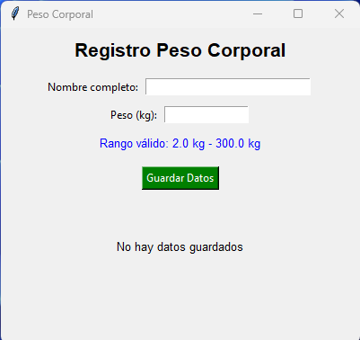

# Proyecto registro-personal

He hecho una aplicación web donde nos permite registar la altura y el peso de un usuario. La aplicación no solo guarda datos, sino que automáticamente te calcula el indice de masa corporal (IMC).

## 🚀 Características principales

- Registro de peso y altura a los usuarios
- Historial de peso y altura de los usuarios
- Cálculo automático del IMC
- Mensajes de error y confirmación
- Tests automatizados con cobertura

## 🛠️ Tecnologías

- python3

## ⚙️ Instalación y ejecución de la aplicación

1. Lo primero de todo tenemos que tener instalado el phyton3
- La versión de **python** es 3.14.2 ([Descargar aquí](https://www.python.org/downloads/))

2. Este es el comando para poder instalar y usar el **tkinder** de la plaicación

```bash
pip install tk
```

3. Para poder ejecutar la aplicación nos vamos a la cmd `cd registro-personal/src` y pondremos el siguiente comando

```bash
python corporal.py
```

Al ejecutar es comando anterior se tendría que ver de esa forma



